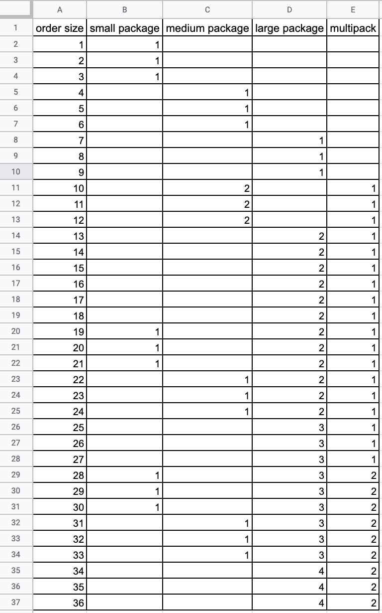

# Packages calculator #

The customer sales item 'A' online. Depending on an order size the product 
should be packaged into particular type of package, which also could have
different size and quantity, for example: 3 small packages, 1 large package.

### Types of packages ###

* small package - 3 items
* medium package - 6 items
* large package - 9 items
* multipack - set of packages

### How it works ###

The method takes as an argument a size of order.
Returns the quantity and types of packages,
which are necessary for packaging the order.

The method works with a max. of 100 items and is based on the first 36 results from this table:

